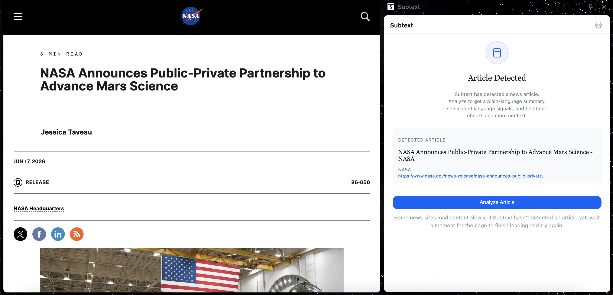
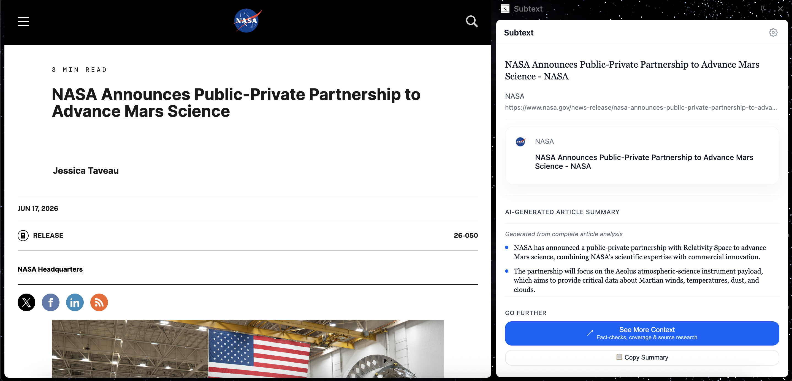
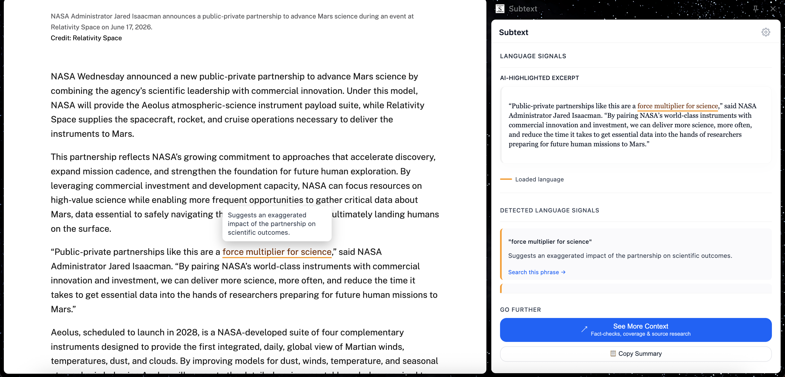

# Subtext

A Chrome extension for critical news reading. Subtext detects news articles as you browse, then on demand produces an AI-generated summary, flags emotionally loaded language, and surfaces fact-check and source research links — all without leaving the page.

---

## Features

- **Article detection** — automatically identifies standalone news articles using Mozilla Readability and a multi-signal heuristic scorer
- **AI summary** — concise bullet-point summary of the article's key points, generated via OpenAI
- **Loaded language signals** — highlights phrases with emotionally charged or manipulative framing, with a short explanation for each
- **See More Context** — one-click access to Google News coverage, fact-check searches, source background (AllSides, Wikipedia), and the original article
- **Session cache** — analysis results are cached for the browser session so revisiting an article restores highlights and results instantly

---

## Screenshots

---

## Requirements

- Google Chrome (or any Chromium-based browser)
- An [OpenAI API key](https://platform.openai.com/api-keys)

Subtext calls the OpenAI API directly from your browser using your own key. Your key is stored locally in Chrome's extension storage and is never transmitted anywhere other than OpenAI.

---

## Installation

This extension is not published to the Chrome Web Store. Load it manually as an unpacked extension:

1. Clone or download this repository
2. Open Chrome and navigate to `chrome://extensions`
3. Enable **Developer mode** (toggle in the top-right corner)
4. Click **Load unpacked** and select the repository folder
5. The Subtext icon will appear in your toolbar

---

## Setup

On first use, you need to provide your OpenAI API key:

1. Click the Subtext icon to open the side panel, then click the **⚙** settings icon in the top-right corner
2. Enter your OpenAI API key in the **API key** field and click **Save key**
3. Navigate to any news article — Subtext will detect it automatically
4. Click **Analyze Article** to run an analysis

Subtext uses the `gpt-4o-mini` model. At typical article lengths, each analysis costs less than $0.01.

---

## Architecture

| File | Role |
|---|---|
| `background.js` | MV3 service worker — session management, article detection pipeline, OpenAI call, result cache |
| `content_script.js` | Injected into pages — Readability extraction, article scoring, DOM highlighting |
| `sidepanel/sidepanel.js` | Side panel UI — renders detection state, loading animation, and analysis results |
| `options/options.js` | Settings page — API key management and cache controls |
| `context/context.js` | Standalone research page — builds fact-check and source links from URL params |
| `logger.js` | Forwards log messages from non-background contexts to the service worker console |
| `vendor/Readability.js` | Mozilla Readability — article extraction |

**Analysis flow:**

1. Panel opens → background injects `content_script.js` on demand and runs Readability
2. Content script scores the page against article-detection heuristics (threshold: score ≥ 4 = high confidence)
3. On user request, background fetches the full article text, trims it to 18,000 characters at a sentence boundary, and sends it to `gpt-4o-mini`
4. The model returns structured JSON — bullet point summary and loaded language indicators with matched phrases
5. Background sends `APPLY_HIGHLIGHTS` to the content script, which wraps matched phrases in `` using a `TreeWalker`
6. Results are delivered to the panel and written to session cache

A monotonic run ID on each panel session ensures stale results from cancelled or superseded analyses are silently discarded.

---

## Permissions

| Permission | Why it's needed |
|---|---|
| `sidePanel` | Renders the analysis UI in Chrome's native side panel |
| `scripting` | Injects `content_script.js` and `Readability.js` into article pages on demand |
| `storage` | Persists the API key (`chrome.storage.local`) and analysis cache (`chrome.storage.session`) |
| `favicon` | Displays source favicons in the analysis card |
| `host_permissions: *` | Articles exist on any domain; the extension reads the page only when the user opens the panel |

No data is collected. No analytics. No remote servers. All processing happens between your browser and OpenAI.

---

## License

© 2025 Nikki Ha. All rights reserved. See [LICENSE](LICENSE) for details.

Third-party licenses: [THIRD_PARTY_LICENSES.txt](THIRD_PARTY_LICENSES.txt)
